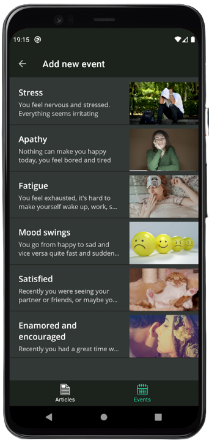
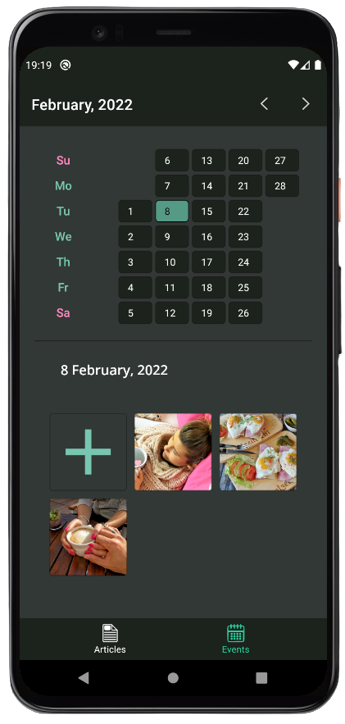

# XApplication

The application provides people information about vital sexual and reproductive health care and sex education.

## Technologies

### Code
- Language: **kotlin**;
- Concurrency: **coroutines**;
- DI: **Hilt**;
- Data persistance: **Room** (Room FTS for fulltext search), **Firebase (Firestore, Storage)**, **Paging3**;
- Architecture: **MVVM** (**ViewModel**, **LiveData**);
- Navigation: **Navigation component**;
- Testing: **JUnit4**, **Mockito-kotlin**;
- Utils: **Timber**, **Gson**, **SpeechToText**, **ktx**.

> Earlier I used Java+RxJava2, but turned to kotlin

### Others

- Prototype: **Miro**;
- Design: **Figma**;
- Icons: **Inkscape**, **Paint Tool Sai**;
- Managing: **Trello**.

## Functions
### Calendar with events

You can add events for every day. There are several **categories** of events (like mood, feelings, relations). For every category, you can select one of the **templates** and add more info by **answering questions**.
You can get some help: **get some tips** and **read a page** on the topic of the event.

&nbsp;&nbsp;&nbsp;&nbsp;&nbsp;&nbsp;&nbsp;&nbsp;&nbsp;&nbsp;&nbsp;&nbsp;

### Read articles

Search articles on interesting topics using search and tags. You give feedback to these articles.
Each article includes several pages, on some of them, you can see tips: short and easy-to-remember pieces of information. And you also can give feedback to them.

&nbsp;&nbsp;&nbsp;&nbsp;&nbsp;&nbsp;&nbsp;&nbsp;&nbsp;&nbsp;&nbsp;&nbsp;

### Dark theme is available

&nbsp;&nbsp;&nbsp;&nbsp;&nbsp;&nbsp;&nbsp;&nbsp;&nbsp;&nbsp;&nbsp;&nbsp;

## The sense of the application
Sexual education is an important topic because many people don't aware about it enough. As the result, there are many teenage pregnancies and the prevalence of sexually transmitted diseases is high. Some people want to know more about this topic but they don't know how, so they need resources of information like this application.
The main sense of this app - is to provide information not only when the user directly asks a particular question, but when they don't know if their actions are correct or what should they expect from some events.

## More materials
- **figma design** - https://www.figma.com/file/GtGmLwNkqdPWKq34LOXmOm/xApp?node-id=0%3A1
- **entity relationship** - https://drive.google.com/file/d/12AQXU3goFPJiSijX0bHK69KONbX2pSM_/view?usp=sharing
- **first prototype** -  https://miro.com/app/board/o9J_lw7s_Dg=/
